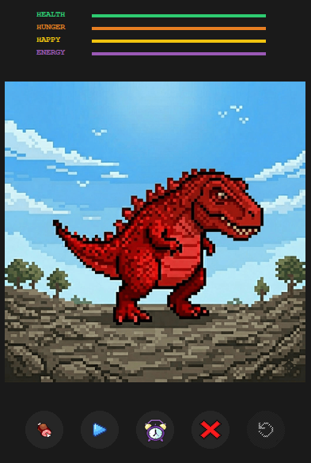
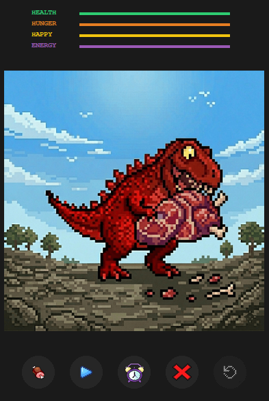
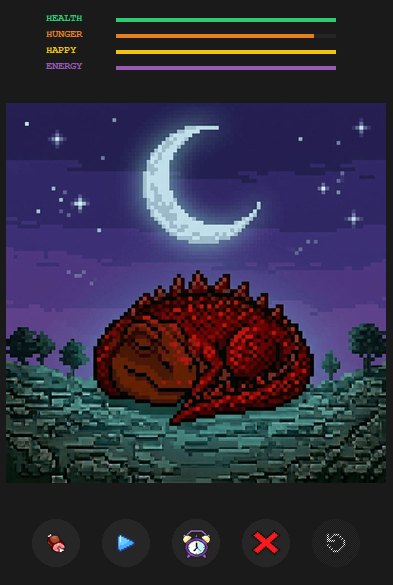
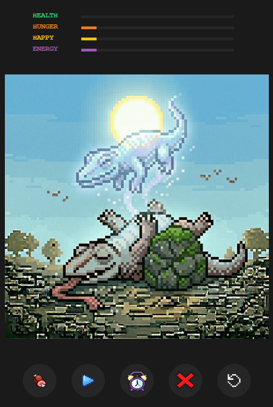

# BITBUDDY

> An interactive desktop virtual pet built in Python using object-oriented programming, featuring real-time stat depletion, custom GIF animations, and a persistent JSON save/load system.

---

## Screenshots

| Main Dashboard | Feeding |
|---|---|
|  |  |

| Sleep Mode | Game Over |
|---|---|
|  |  |

---

## Features

- **Real-Time Simulation** — Stats deplete every 4 seconds, requiring active care to keep the pet alive.
- **Dynamic HUD** — Color-coded status bars (Health, Hunger, Happy, Energy) that update in real-time.
- **Always-On-Top GUI** — Stays visible above other windows as a true desktop companion.
- **Draggable Interface** — Frameless window design that can be positioned anywhere on the screen.
- **State Persistence** — Automatic saving to `pet_stats.json` on every action and during exit.
- **Action System** — Dedicated buttons for Feeding, Playing, and Sleeping with unique GIF animations.
- **Revive Mechanic** — Restart and heal the pet after a Game Over state.

---

## Project Structure

```
BitBuddy/
├── assets/             # GIF animations and PNG icons
│   ├── idle.gif
│   ├── eat.gif
│   ├── play.gif
│   ├── sleep.gif
│   ├── dead.gif
│   └── meat.png
├── screenshots/        # README gallery images
├── main.py             # Tkinter GUI and animation controller
├── pet.py              # Core logic and data persistence
├── pet_stats.json      # Local save data (JSON)
├── .gitignore
└── README.md
```

---

## Installation

**1. Clone the repository:**
```bash
git clone https://github.com/hashir500/BitBuddy.git
cd BitBuddy
```

**2. Install dependencies:**
```bash
pip install Pillow
```

> On Windows with the Python launcher: `py -m pip install Pillow`

---

## How to Run

```bash
py main.py
```

---

## Gameplay & Controls

### Pet Statistics

| Stat | Max | Depletion | Impact |
|---|---|---|---|
| Health | 100 | Special | Drops by 5 if Hunger reaches 0 |
| Hunger | 100 | -2 / tick | Feeds for +20; triggers Health loss |
| Happiness | 100 | -1 / tick | Increased by Playing (+25) |
| Energy | 100 | -1 / tick | Restored by Sleeping (+40) |

### Interactions

| Button | Effect |
|---|---|
| `MEAT` | Restores hunger and a small amount of health |
| `PLAY` | Boosts happiness but costs 10 energy |
| `SLEEP` | Fully restores energy and heals health |
| `REVIVE` | Only available when Health reaches 0 |
| `EXIT` | Saves current stats and closes the application |

---

## Technical Highlights

- **Object-Oriented Design** — Clean separation of game logic (`pet.py`) and view/controller (`main.py`).
- **JSON Serialization** — Stats stored in structured JSON for persistence between sessions.
- **Frame-by-Frame Animation** — GIF files decomposed into individual frames and cached using Pillow.
- **Async Loop** — Uses Tkinter's `.after()` method for non-blocking stat depletion and animation updates.
- **Event Handling** — Custom mouse-binding logic for dragging the borderless window.

---

## Requirements

- Python 3.x
- [Pillow](https://pypi.org/project/Pillow/)

---

## License

This project is open source .